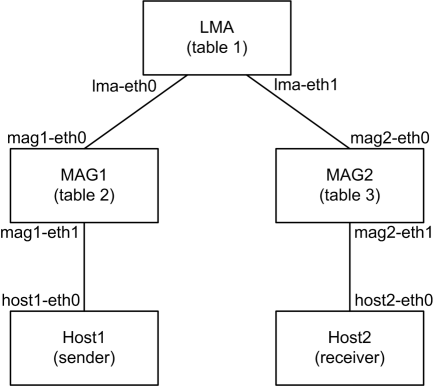

<!--vim: set textwidth=80 formatoptions+=t wrapmargin=5 -->

Mcproxy and Mininet
===================
Here you can find examples of how to use mcproxy within [mininet](mininet.org).

Requirements
------------
You have to install mininet, which can usually be done with the following command:
    sudo apt-get install mininet
    
You have to compile the mcproxy and the mcproxy tester (see chapter mcproxy tester in ../README).

Usage   
-----   
    sudo su
    mn -c
    python2 network.py  

The topologie discribed by the file network.py looks like this:   
                  
                         +-----------+
                         |           |
                         |   #LMA#   |
                         |  (table 1)|
                         +-----------+
                  lma-eth0 /       \ lma-eth1         
                         /           \        
                       /               \      
                     /                   \    
                   /                       \  
                 /                           \
     mag1-eth0 /                               \ mag2-eth0
         +-----------+                   +-----------+
         |           |                   |           |
         |  #MAG1#   |                   |  #MAG2#   |
         |  (table 2)|                   |  (table 3)|
         +-----------+                   +-----------+
     mag1-eth1 |                               | mag2-eth1 
               |                               | 
               |                               | 
               |                               | 
    host1-eth0 |                               | host2-eth0 
         +-----------+                   +-----------+
         |           |                   |           |
         |  #Host1#  |                   |  #Host2#  |
         |   (sender)|                   | (receiver)|
         +-----------+                   +-----------+

asdf asdf asdf asdf 

asdf asdf adsf

On the boxes LMA, MAG1, and MAG2 runs a single proxy instance each with a
different multicast routing table. The behaviour every instance are described
in configuration files lma.conf, mag1.conf, mag2.conf.  The Host1 sends group
packages of the group 239.99.99.99 to the interface host1-eth0 and Host2
receives hopefully these packages on inteface host2-eth0. The exact behaviours
of the hosts are described in the file tester.ini. as
     
   
   
